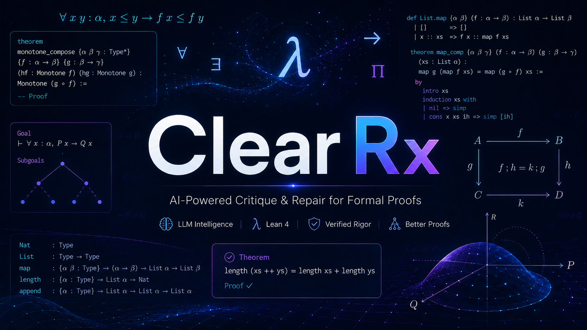

<p align="center">
  
</p>

# ClearRx FormalRx Reproducibility Package

Technical code folder for **AI4Math-2026 Track 1: Semantic Alignment Evaluation for Autoformalization (FormalRx)**.

ClearRx predicts the required four-field FormalRx diagnosis for each row:

- `verdict`: `aligned` or `misaligned`
- `error_category`: one of the SCI-28 categories, or `null`
- `error_segment`: smallest Lean fragment responsible for the mismatch, or `null`
- `corrected_statement`: corrected Lean 4 statement, or `null`

The final diagnosis is produced by the `criticleanGPT-Qwen3-8B-RL` runtime through a Dockerized OpenAI-compatible llama.cpp endpoint. The surrounding code in this repository handles dataset download, row-local premodel evidence, prompt rendering, endpoint calls, schema normalization, validation, reports, and Codabench zip creation.

## Why This Repo Exists

The challenge requires reproducibility. This repository is intended to make the submitted method easy to rerun without relying on notebook state, manual row edits, test-set retrieval, or hidden cross-row logic.

ClearRx is deliberately row-local:

- each prediction is computed from exactly one FormalRx row;
- no information from other levels, variants, reformulations, or related rows
  of the same problem is used during inference;
- the test set is never used as a retrieval corpus;
- rows are never placed together in a shared model context;
- output order is preserved from the input JSONL;
- null handling and Codabench schema checks are explicit.

## Repository Layout

```text
.
├── clearrx/                     # prompts, endpoint calls, schema checks, premodel evidence
├── prompts/
│   ├── formalrx_system_prompt.md
│   ├── formalrx_prompt_template.txt
│   └── sci_28_taxonomy.json
├── EVALUATION_PROTOCOL.md       # required inference/evaluation disclosure
├── TEAM.md                      # required team information
├── scripts/
│   ├── download_dataset.py
│   ├── download_runtime.sh
│   ├── start_runtime.sh
│   ├── check_endpoint.py
│   ├── run_smoke_10.sh
│   ├── run_smoke_100.sh
│   └── validate_predictions.py
├── examples/
│   └── request_template.json
├── tests/
├── data/                        # local dataset location, gitignored
├── runtime/                     # local Hugging Face runtime clone, gitignored
└── outputs/                     # local predictions/reports/zips, gitignored
```

## Host Requirements

The submitted runtime path is Docker-first. The host should provide:

- Linux x86-64 with an NVIDIA GPU;
- AVX512-capable CPU;
- a working NVIDIA driver visible through `nvidia-smi`;
- Docker with NVIDIA GPU support;
- Git and Git LFS;
- Python 3.10 or newer for the ClearRx runner.

Minimal Ubuntu/Debian setup:

```bash
sudo apt update
sudo apt install -y git git-lfs python3 python3-venv python3-pip curl
git lfs install
```

Check Docker GPU access:

```bash
nvidia-smi
docker --version
docker run --rm --gpus all nvidia/cuda:12.8.1-runtime-ubuntu22.04 nvidia-smi
```

## Fresh Clone Setup

```bash
git clone https://github.com/neelshah123098/critic-rx.git
cd critic-rx

python3 -m venv .venv
source .venv/bin/activate
python -m pip install --upgrade pip
python -m pip install -r requirements.txt
```

## Submission Documents

- Source code and reproduction instructions: this repository and this README.
- Evaluation protocol and required disclosures: `EVALUATION_PROTOCOL.md`.
- Team information: `TEAM.md`.

## Download The FormalRx Test Set

The official test set is hosted at `LARK-Lab/FormalRx-Test`.

```bash
python scripts/download_dataset.py \
  --repo-id LARK-Lab/FormalRx-Test \
  --output data/FormalRx_Test.jsonl
```

Expected row count for the challenge test set: `7030`.

## Download The CriticLeanGPT Docker Runtime

Download the Hugging Face runtime/model package. This uses Git LFS because
`model.gguf` and `bin/llama-server` are large files:

```bash
bash scripts/download_runtime.sh
```

By default this downloads:

```text
neelshah123098/criticleanGPT-Qwen3-8B-RL
```

into:

```text
runtime/criticleanGPT-Qwen3-8B-RL
```

The runtime clone should contain:

```text
model.gguf
bin/llama-server
run.sh
Dockerfile
docker-compose.yml
prompts/
clients/
examples/
```

Important size check: `model.gguf` should be several GB and
`bin/llama-server` should be hundreds of MB. If either file is only a few
bytes, Git LFS did not pull the real artifacts:

```bash
git -C runtime/criticleanGPT-Qwen3-8B-RL lfs pull
ls -lh runtime/criticleanGPT-Qwen3-8B-RL/model.gguf \
       runtime/criticleanGPT-Qwen3-8B-RL/bin/llama-server
```

The intended runtime contract is:

- use the Docker image built from the downloaded runtime repository;
- use non-streaming `/v1/chat/completions`;
- keep `temperature` at `0`;
- keep `max_tokens=1024`;
- keep request timeout at `300` seconds for long rows;
- do not JSON-wrap the FormalRx row in the user message;
- keep the row prompt in `prompts/formalrx_prompt_template.txt`.

Changing prompt shape or generation settings can change endpoint behavior.

## Start The Docker Runtime

In one terminal:

```bash
bash scripts/start_runtime.sh
```

This builds the runtime image and runs:

```text
host port 8001 -> container port 8000
CTX_SIZE=16384
N_GPU_LAYERS=99
```

Equivalent manual Docker command from the runtime directory:

```bash
cd runtime/criticleanGPT-Qwen3-8B-RL

docker build -t criticleangpt-qwen3-8b-rl-formalrx:local .

docker run --rm --gpus all \
  -p 8001:8000 \
  -e CTX_SIZE=16384 \
  -e N_GPU_LAYERS=99 \
  criticleangpt-qwen3-8b-rl-formalrx:local
```

Alternatively:

```bash
cd runtime/criticleanGPT-Qwen3-8B-RL
docker compose up --build
```

In another terminal:

```bash
curl http://127.0.0.1:8001/health
python scripts/check_endpoint.py --base-url http://127.0.0.1:8001/v1
```

Expected health response:

```json
{"status":"ok"}
```

Keep the Docker server terminal running while inference runs.

## First-10 Smoke Test

Run a short endpoint/prompt/schema check first:

```bash
bash scripts/run_smoke_10.sh
```

This writes:

```text
outputs/formalrx_first10_predictions.jsonl
outputs/formalrx_first10_report.json
outputs/formalrx_first10_predictions.zip
```

The report should show `valid_responses` equal to `10`, with `parse_errors`
and `request_errors` equal to `0`.

## First-100 Check

After the 10-row smoke test passes:

```bash
bash scripts/run_smoke_100.sh
```

This writes:

```text
outputs/formalrx_first100_predictions.jsonl
outputs/formalrx_first100_report.json
outputs/formalrx_first100_predictions.zip
```

The report includes:

- `valid_responses`
- `parse_errors`
- `request_errors`
- `schema_errors`
- `rows_written`

For the pinned endpoint and prompt contract, the expected 100-row behavior is
`100 / 100` valid responses with `0` parse errors and `0` request errors.
The runner also applies deterministic output normalization required by the scorer:
aligned rows are written with null diagnosis fields, `N/A` is treated as null,
and known endpoint spelling aliases are mapped to official SCI labels.

## Final Premodel Pipeline

ClearRx uses a deterministic row-local premodel to construct the final
system-prompt add-on for every row. This is the default method for the
reproducibility package.

The premodel does not call another LLM and does not decide the final answer. It
extracts cues from the current row, accounts for all 28 FormalRx SCI categories,
adds a ranked shortlist of likely categories with evidence, and then leaves the
final verdict/category/span/repair to the CriticLeanGPT endpoint.

```bash
python -m clearrx.run_formalrx \
  --dataset data/FormalRx_Test.jsonl \
  --base-url http://127.0.0.1:8001/v1 \
  --model criticleanGPT-Qwen3-8B-RL \
  --limit 100 \
  --timeout 300 \
  --max-tokens 1024 \
  --premodel-context-output outputs/formalrx_first100_contexts.jsonl \
  --output outputs/formalrx_first100_predictions.jsonl \
  --report outputs/formalrx_first100_report.json \
  --fail-on-error
```

The prompt context can be audited with `--premodel-context-output`; it is not
required for Codabench submission.

## Full Submission Run

```bash
python -m clearrx.run_formalrx \
  --dataset data/FormalRx_Test.jsonl \
  --base-url http://127.0.0.1:8001/v1 \
  --model criticleanGPT-Qwen3-8B-RL \
  --timeout 300 \
  --max-tokens 1024 \
  --output outputs/formalrx_full_predictions.jsonl \
  --report outputs/formalrx_full_report.json \
  --zip-output outputs/formalrx_full_predictions.zip
```

Validate before uploading:

```bash
python scripts/validate_predictions.py \
  --dataset data/FormalRx_Test.jsonl \
  --predictions outputs/formalrx_full_predictions.jsonl \
  --expected-count 7030
```

The Codabench archive must contain a single file named `predictions.jsonl`.

## Chunked Runs

For shorter validation batches, use `--offset` and `--limit`:

```bash
python -m clearrx.run_formalrx \
  --dataset data/FormalRx_Test.jsonl \
  --base-url http://127.0.0.1:8001/v1 \
  --model criticleanGPT-Qwen3-8B-RL \
  --offset 1000 \
  --limit 100 \
  --timeout 300 \
  --max-tokens 1024 \
  --output outputs/formalrx_rows_1000_1099_predictions.jsonl \
  --report outputs/formalrx_rows_1000_1099_report.json
```

## Method Summary

ClearRx follows the report protocol:

1. reconstruct the intended theorem from the informal statement;
2. reconstruct the theorem expressed by the Lean statement;
3. compare mathematical meaning, not surface wording;
4. route mismatches through the SCI-28 taxonomy;
5. localize the smallest responsible Lean fragment;
6. produce the minimal local repair;
7. return exactly one JSON object.

The premodel implements steps 1-4 as deterministic row-local evidence:
`IntentLens` extracts informal cues, `LeanLens` extracts Lean cues, `DeltaMap`
creates semantic checkpoints, and `TaxonomyLens` maps those checkpoints into a
ranked SCI-28 shortlist. These are hints only; the model still independently
chooses the final verdict, category, segment, and repair.

The default request payload intentionally uses the pinned runtime prompt assets in `prompts/`.
The report-level protocol is documented in `docs/clearrx_method.md` and
`EVALUATION_PROTOCOL.md`.
The runner does not add row-to-row memory, retrieval over the test set, manual labels, or leaderboard-result probing.
The runner also does not use information from other levels, variants,
reformulations, or related rows of the same problem during inference.

## Troubleshooting

If Docker cannot see the GPU, fix NVIDIA Container Toolkit first:

```bash
docker run --rm --gpus all nvidia/cuda:12.8.1-runtime-ubuntu22.04 nvidia-smi
```

If `model.gguf` or `bin/llama-server` is tiny, pull Git LFS artifacts:

```bash
git -C runtime/criticleanGPT-Qwen3-8B-RL lfs pull
ls -lh runtime/criticleanGPT-Qwen3-8B-RL/model.gguf \
       runtime/criticleanGPT-Qwen3-8B-RL/bin/llama-server
```

If `/health` fails:

```bash
docker ps
curl http://127.0.0.1:8001/health
```

If responses look like ordinary prose, empty text, or non-mathematical text:

1. confirm the Docker image was built from `neelshah123098/criticleanGPT-Qwen3-8B-RL`;
2. confirm the final user message matches `prompts/formalrx_prompt_template.txt`;
3. keep `temperature=0`;
4. keep `max_tokens=1024`;
5. keep the model name as `criticleanGPT-Qwen3-8B-RL`;
6. run `bash scripts/run_smoke_10.sh`, then `bash scripts/run_smoke_100.sh`, before attempting the full test set.
